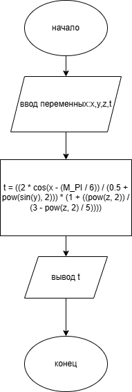
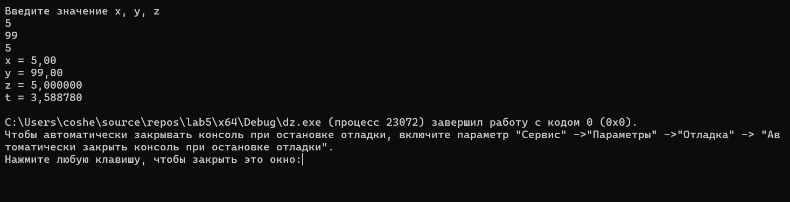

# Домашнее задание к работе 5
## Условие задачи
Два программиста, Анна (A) и Борис (B), дежурят ночью. Чтобы было не так скучно, они решили, что будут пить кофе только если кто-то один из них четный (по номеру своего рабочего места).
Запишите условие для кофе-машины.
## 1. Алгоритм и блок-схема
### Алгоритм
1. Начало
2. Объявить константы:
   - x = переменная.
   - y = переменная.
   - z = переменная.
   - t = расчёт.
3. Считаем:
  t = ((2 * cos(x - (M_PI / 6)) / (0.5 + pow(sin(y), 2))) * (1 + ((pow(z, 2)) / (3 - pow(z, 2) / 5))))
4. Выводим результаты расчетов:
   -  printf("t = %.6f\n", t);
5. Конец
### Блок-схема

## 2. Реализация программы:
#define _CRT_SECURE_NO_WARNINGS
#define _USE_MATH_DEFINES
#include <locale.h>
#include <stdio.h>
#include <stdlib.h>
#include <conio.h>
#include <math.h>
#define M_PI 3.14159265358979323846

int main() 
{
    setlocale(LC_ALL, "");
    double x, y, z, t;
    printf("Введите значение x, y, z\n");
    scanf("%lf", &x);
    scanf("%lf", &y);
    scanf("%lf", &z);
 
    printf("x = %.2f\n", x);
    printf("y = %.2f\n", y);
    printf("z = %.6f\n", z);

    t = ((2 * cos(x - (M_PI / 6)) / (0.5 + pow(sin(y), 2))) * (1 + ((pow(z, 2)) / (3 - pow(z, 2) / 5))));

    printf("t = %.6f\n", t);

}
## 3. Результат работы программы

## 4. Информация о разработчике
Амелина Юлия, бИПТ-252
